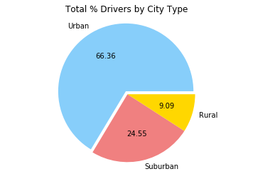

```python
### Analysis

# • Overall adoption is clearly highest in “Urban” city types. Roughly 3x as many drivers & rides as the next highest group (“Suburban”) can be found there.

# • Average fares increase as we move away from urban areas into the rural. Not one “Urban” location appears to have an average fare over $30.

# • Whereas “Suburban” fares almost entirely average between $25-$35. “Suburban” rides, despite being a third of the size of “Urban” ridership makes up a larger share of overall fare average. If I were a driver I would consider the Suburbs. There is less overall competition and higher fares. If I were Pyber, I would also be looking to expand ridership in the Suburbs.  
```


```python
import os
import csv
import pandas as pd
import matplotlib.pyplot as plt
import numpy as np
```


```python
city_path = os.path.join('raw_data', 'city_data.csv')
ride_path = os.path.join('raw_data', 'ride_data.csv')

city_data = pd.read_csv(city_path)
ride_data = pd.read_csv(ride_path)
```


```python
# Your objective is to build a [Bubble Plot](https://en.wikipedia.org/wiki/Bubble_chart) that showcases the relationship between four key variables:
```


```python
combined_data_df = pd.merge(city_data, ride_data, on="city", how="outer")
combined_data_df.head()
```


<div>
<style>
    .dataframe thead tr:only-child th {
        text-align: right;
    }

    .dataframe thead th {
        text-align: left;
    }

    .dataframe tbody tr th {
        vertical-align: top;
    }
</style>
<table border="1" class="dataframe">
  <thead>
    <tr style="text-align: right;">
      <th></th>
      <th>city</th>
      <th>driver_count</th>
      <th>type</th>
      <th>date</th>
      <th>fare</th>
      <th>ride_id</th>
    </tr>
  </thead>
  <tbody>
    <tr>
      <th>0</th>
      <td>Kelseyland</td>
      <td>63</td>
      <td>Urban</td>
      <td>2016-08-19 04:27:52</td>
      <td>5.51</td>
      <td>6246006544795</td>
    </tr>
    <tr>
      <th>1</th>
      <td>Kelseyland</td>
      <td>63</td>
      <td>Urban</td>
      <td>2016-04-17 06:59:50</td>
      <td>5.54</td>
      <td>7466473222333</td>
    </tr>
    <tr>
      <th>2</th>
      <td>Kelseyland</td>
      <td>63</td>
      <td>Urban</td>
      <td>2016-05-04 15:06:07</td>
      <td>30.54</td>
      <td>2140501382736</td>
    </tr>
    <tr>
      <th>3</th>
      <td>Kelseyland</td>
      <td>63</td>
      <td>Urban</td>
      <td>2016-01-25 20:44:56</td>
      <td>12.08</td>
      <td>1896987891309</td>
    </tr>
    <tr>
      <th>4</th>
      <td>Kelseyland</td>
      <td>63</td>
      <td>Urban</td>
      <td>2016-08-09 18:19:47</td>
      <td>17.91</td>
      <td>8784212854829</td>
    </tr>
  </tbody>
</table>
</div>


```python
# URBAN RIDE INFO

urban_data = combined_data_df.loc[combined_data_df["type"] == "Urban"]#.count()
urban_data = pd.DataFrame(urban_data)

urban_data.head()

urban_places = urban_data.groupby("city")

urban_fares_avg = urban_places['fare'].mean()
urban_fares_avg = pd.DataFrame(urban_fares_avg).reset_index()

# * Total Number of Rides Per City
urban_rides = urban_places['ride_id'].count()
urban_rides = pd.DataFrame(urban_rides).reset_index()

# Total Number of Drivers

urban_drivers = urban_places['driver_count'].max()
urban_drivers = pd.DataFrame(urban_drivers).reset_index()
urban_drivers['driver_count'] = pd.to_numeric(urban_drivers['driver_count'])

urban_merge = pd.merge(urban_fares_avg, urban_rides, on='city', how='outer')

urban_merge = pd.merge(urban_fares_avg, urban_rides, on='city', how='outer')

urban_merge2 = pd.merge(urban_merge, urban_drivers, on='city', how='outer')
```


```python
# SUBURBAN RIDE INFO

suburban_data = combined_data_df.loc[combined_data_df["type"] == "Suburban"]#.count()
suburban_data = pd.DataFrame(suburban_data)

suburban_places = suburban_data.groupby("city")

suburban_fares_avg = suburban_places['fare'].mean()
suburban_fares_avg = pd.DataFrame(suburban_fares_avg).reset_index()

# * Total Number of Rides Per City
suburban_rides = suburban_places['ride_id'].count()
suburban_rides = pd.DataFrame(suburban_rides).reset_index()

# Total Number of Drivers

suburban_drivers = suburban_places['driver_count'].max()
suburban_drivers = pd.DataFrame(suburban_drivers).reset_index()
suburban_drivers['driver_count'] = pd.to_numeric(suburban_drivers['driver_count'])

suburban_merge = pd.merge(suburban_fares_avg, suburban_rides, on='city', how='outer')

suburban_merge = pd.merge(suburban_fares_avg, suburban_rides, on='city', how='outer')

suburban_merge2 = pd.merge(suburban_merge, suburban_drivers, on='city', how='outer')
```


```python
# RURAL RIDE INFO

rural_data = combined_data_df.loc[combined_data_df["type"] == "Rural"]#.count()
rural_data = pd.DataFrame(rural_data)

rural_places = rural_data.groupby("city")

rural_fares_avg = rural_places['fare'].mean()
rural_fares_avg = pd.DataFrame(rural_fares_avg).reset_index()

# * Total Number of Rides Per City
rural_rides = rural_places['ride_id'].count()
rural_rides = pd.DataFrame(rural_rides).reset_index()

# Total Number of Drivers

rural_drivers = rural_places['driver_count'].max()
rural_drivers = pd.DataFrame(rural_drivers).reset_index()
rural_drivers['driver_count'] = pd.to_numeric(rural_drivers['driver_count'])

rural_merge = pd.merge(rural_fares_avg, rural_rides, on='city', how='outer')

rural_merge = pd.merge(rural_fares_avg, rural_rides, on='city', how='outer')

rural_merge2 = pd.merge(rural_merge, rural_drivers, on='city', how='outer')

```


```python
s=(urban_merge2['driver_count'])
ax = urban_merge2.plot(kind="scatter", x="ride_id", y="fare", s=s*10, Facecolors="LightSkyBlue", Edgecolor="Black", alpha=".75", grid=True, figsize=(9,6))

s=(suburban_merge2['driver_count'])
suburban_merge2.plot(kind="scatter", x="ride_id", y="fare", s=s*10, Facecolors="Lightcoral", Edgecolor="Black", alpha=".75", ax=ax)

s=(rural_merge2['driver_count'])
rural_merge2.plot(kind="scatter", x="ride_id", y="fare", s=s*10, Facecolors="gold", Edgecolor="Black", ax=ax)

#plt.xlim = ([0,100])
#plt.ylim = ([0,100])
plt.title('Pyber Ride Sharing Data (2016)')
plt.xlabel('Number of Rides')
plt.ylabel('Average Fare ($)')
plt.grid(True)
plt.figtext(.95, .8, "NOTE: Circle size correlates with driver count")
#plt.legend()
plt.show()

#grid=True, figsize=(10, 5)
```


```python
# Making the Py Charts

## % Total Fares by City Type

urban_fares_total = urban_data['fare'].sum()
suburban_fares_total = suburban_data['fare'].sum()
rural_fares_total = rural_data['fare'].sum()

city_type_fare = ["Urban", "Suburban", "Rural"]
city_rides_fares = [urban_fares_total, suburban_fares_total, rural_fares_total]

colors = ["lightskyblue", "lightcoral", "gold"]
explode = [0.05, 0, 0]

plt.pie(city_rides_fares, explode=explode, labels=city_type_fare, colors=colors, autopct='%.2f')


plt.axis("equal") 

plt.title("Total % Fares by City Type")
plt.show()


```


```python
## % Total Rides by City Type

urban_rides_total = urban_data['ride_id'].count()
suburban_rides_total = suburban_data['ride_id'].count()
rural_rides_total = rural_data['ride_id'].count()

city_type_rides = ["Urban", "Suburban", "Rural"]
city_rides_rides = [urban_rides_total, suburban_rides_total, rural_rides_total]

colors = ["lightskyblue", "lightcoral", "gold"]
explode = [0.05, 0, 0]

plt.pie(city_rides_rides, explode=explode, labels=city_type_fare, colors=colors, autopct='%.2f')

plt.axis("equal")
plt.title("Total % Rides by City Type")
plt.show()
```


```python
## % Total Drivers by City Type

urban_drivers_total = urban_data['driver_count'].max()
suburban_drivers_total = suburban_data['driver_count'].max()
rural_drivers_total = rural_data['driver_count'].max()

city_type_drivers = ["Urban", "Suburban", "Rural"]
city_rides_drivers = [urban_drivers_total, suburban_drivers_total, rural_drivers_total]

colors = ["lightskyblue", "lightcoral", "gold"]
explode = [0.05, 0, 0]

plt.pie(city_rides_drivers, explode=explode, labels=city_type_fare, colors=colors, autopct='%.2f')

plt.axis("equal")
plt.title("Total % Drivers by City Type")
plt.show()
```




